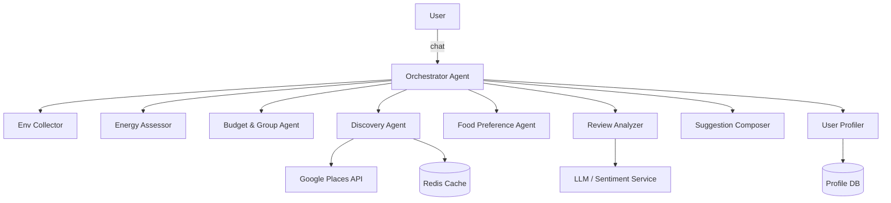
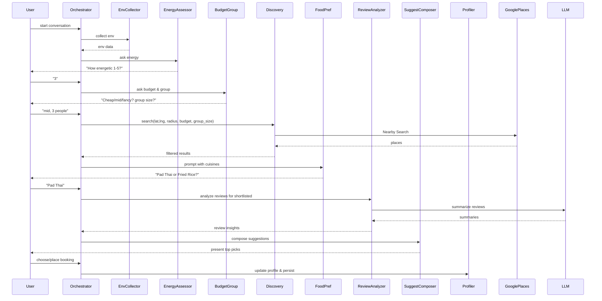

# Multi-Agent Restaurant Recommender — ADK Project Blueprint

**Tooling:** ADK (Agent Development Kit) as primary toolkit; FastAPI (optional backend), Node.js (optional), Google Places API, persistent DB (Postgres), Redis cache, S3 for images.

---

## Table of contents
1. Project skeleton (ADK-focused)
2. Full agent graph (Mermaid + sequence)
3. Full prompt set (copy/paste-ready) for each agent
4. API & service interfaces (endpoints + message schemas)
5. FastAPI skeleton with ADK integration (Python)
6. Node.js skeleton with ADK integration (Express + ADK client)
7. LangGraph / Vertex AI notes (ADK mapping)
8. Testing plan, deployment, and monitoring
9. Privacy & consent flows
10. Appendix: utility functions & ranking algorithm

---

## 1) Project skeleton (ADK-focused)

```
project/
├── adk_project/                  # ADK agent definitions, pipelines, connectors
│   ├── agents/
│   │   ├── orchestrator.agent.json
│   │   ├── env_collector.agent.json
│   │   ├── energy_assessor.agent.json
│   │   ├── budget_group.agent.json
│   │   ├── discovery.agent.json
│   │   ├── review_analyzer.agent.json
│   │   ├── food_preference.agent.json
│   │   ├── suggestion_composer.agent.json
│   │   ├── user_profiler.agent.json
│   │   └── privacy.agent.json
│   ├── pipelines/
│   │   └── default.pipeline.yaml
│   └── connectors/
│       └── google_places.connector.yaml
│
├── backend/
│   ├── python_fastapi/           # optional API server wrapper
│   │   └── app/
│   │       ├── main.py
│   │       └── adk_client.py     # ADK runtime client
│   └── node_express/             # optional wrapper
│       └── src/
│           ├── server.js
│           └── adkClient.js
│
├── infra/
│   ├── k8s/
│   ├── terraform/
│   └── cloudrun/
│
├── integrations/
│   └── google_places/
│       ├── places_client.py
│       └── places_client.js
│
├── prompts/
│   ├── env_collector.md
│   ├── energy_assessor.md
│   └── ...
│
├── tests/
│   └── unit/
│
└── README.md
```

**Notes:** With ADK you author *agent manifests* (JSON/YAML) that describe each agent's role, input/output schema, runtime hooks (webhook or local handler) and prompts. The orchestrator uses ADK's pipeline orchestration to route messages between agents.

---

## 2) Full agent graph

### Mermaid — High level



### Sequence diagram



---

## 3) Full prompt set (copy/paste-ready)

> **Guideline:** ADK agent manifests should reference these prompt templates. Keep prompts short and constrained. Use system/meta lines for structured output requirements.

### Env Collector
```
SYSTEM: You are Env Collector. Return JSON only.
TASK: Gather current local time, weekday, whether it's a workday, nearby cuisine types (cached), and notable special dates (user calendar if connected).
OUTPUT_SCHEMA: {"local_time": "HH:MM", "weekday": "Monday", "is_workday": true, "special_dates": [{"date":"YYYY-MM-DD","label":"..."}], "food_types": ["Thai","Japanese"]}
```

### Energy Assessor
```
SYSTEM: You are Energy Assessor.
TASK: Ask user a concise question to determine energy level 1–5. Map to radius (1->1000, 2->1000, 3->3000, 4->5000, 5->5000).
If user answer ambiguous, infer using context and mark "inferred":true.
OUTPUT_SCHEMA: {"energy": int, "radius_m": int, "inferred": bool}
```

### Budget & Group Agent
```
SYSTEM: You are Budget & Group Agent. Ask softly.
TASK: Ask the user for price preference using soft categories and group size. Map budgets to Google price_level (0..4). Return JSON.
OUTPUT_SCHEMA: {"budget_level": int, "budget_desc": "cheap/mid/fancy", "budget_pp_estimate": "15-25", "group_size": int, "inferred": bool}
```

### Food Preference Agent
```
SYSTEM: You are Food Preference Agent.
TASK: Given a short list of cuisine types (max 6) ask user to pick or specify dish. Return chosen cuisine.
OUTPUT_SCHEMA: {"preferred_cuisine": "Thai", "preferred_dish": "Pad Thai", "inferred": false}
```

### Discovery Agent
```
SYSTEM: You are Discovery Agent. Use Google Places connector.
TASK: Search nearby restaurants by lat,lng,radius and filter by price_level<=budget and open_now. Return array of up to 20 place objects with fields: place_id,name,lat,lng,distance_m,price_level,rating,user_ratings_total,open_now,opening_hours_snippet.
OUTPUT_SCHEMA: {"places": [ {..} ] }
```

### Review Analyzer
```
SYSTEM: You are Review Analyzer.
TASK: Given N reviews, summarize pros/cons, compute sentiment score [-1..1], and extract "value_score" and "good_for_groups" boolean. Return short 1-line summary.
OUTPUT_SCHEMA: {"place_id":"","avg_rating":4.2,"total_ratings":120,"sentiment":0.72,"pros":"fresh ingredients, quick service","cons":"tight seating","value_score":0.8,"good_for_groups":true,"summary":"Great Pad Thai, good value, small tables"}
```

### Suggestion Composer
```
SYSTEM: You are Suggestion Composer.
TASK: From scored places produce top 3 suggestions. For each include: name,rating,price_level,distance_m,open_until,1-line rationale. Also include action buttons: [Choose], [More info], [Expand radius], [Delivery]. Output JSON.
OUTPUT_SCHEMA: {"suggestions": [ {"place_id":"","name":"","rating":4.3,"price_level":2,"distance_m":1200,"open_until":"21:30","rationale":"..."} ]}
```

### User Profiler
```
SYSTEM: You are User Profiler.
TASK: Update user profile with latest budget, group_size, preferred_cuisines, typical_radius and store interaction with timestamp and feedback. Return updated profile summary.
OUTPUT_SCHEMA: {"user_id":"","price_pref":{...},"typical_group_size":2}
```

### Privacy Agent
```
SYSTEM: You are Privacy Agent.
TASK: Ensure no PII leaks. If user asks to delete data, produce delete plan. Confirm consent for storing location/profile.
OUTPUT_SCHEMA: {"consent": true, "retention_days": 365}
```

---

## 4) API & service interfaces (endpoints + schemas)

### REST endpoints (FastAPI/Express wrapper)

- `POST /chat` — single conversational turn (body: {user_id, message, context_id})
- `GET  /state/{context_id}` — fetch current global state
- `POST /action/{context_id}` — user selects a suggested action (choose, more_info, expand_radius)
- `POST /webhook/places` — webhook for Google Places updates (optional)
- `POST /consent` — store consent

### Message Schema between Orchestrator and Agents
```
{ "context_id": "", "user_id":"", "state":{...}, "intent":"next_step", "payload":{...} }
```

---

## 5) FastAPI skeleton with ADK integration (Python)

> The snippet shows how to call ADK runtime from Python. Replace `adk_client` calls with your ADK SDK functions.

```python
# backend/python_fastapi/app/main.py
from fastapi import FastAPI
from pydantic import BaseModel
from adk_client import ADKClient  # pseudo-import - use ADK SDK

app = FastAPI()
adk = ADKClient()

class ChatRequest(BaseModel):
    user_id: str
    message: str
    context_id: str = None

@app.post('/chat')
async def chat(req: ChatRequest):
    # 1. load state or create
    state = {}  # load from DB or create
    # 2. send to orchestrator agent in ADK
    response = adk.run_agent('orchestrator', {
        'state': state,
        'user_message': req.message,
        'user_id': req.user_id
    })
    # 3. persist state
    # db.save(state)
    return response
```

**ADK notes:**
- Define `orchestrator` agent manifest to accept `state` and `user_message` as input and to orchestrate other agents via ADK `call` primitives.
- ADK runtime can be invoked synchronously or as event-driven pipelines. Use synchronous calls for chat UX but consider async for heavy review analysis.

---

## 6) Node.js skeleton with ADK integration (Express)

```js
// backend/node_express/src/server.js
const express = require('express');
const ADKClient = require('./adkClient'); // wrapper for ADK SDK

const app = express();
app.use(express.json());
const adk = new ADKClient();

app.post('/chat', async (req, res) => {
  const { user_id, message, context_id } = req.body;
  const state = {}; // load state
  const response = await adk.runAgent('orchestrator', { state, user_message: message, user_id });
  // persist state
  res.json(response);
});

app.listen(3000, () => console.log('server listening 3000'));
```

---

## 7) LangGraph / Vertex AI notes (ADK mapping)

- ADK agents map naturally to LangGraph nodes. Each ADK agent becomes a node with input/output ports.
- For Vertex AI Agents: treat ADK orchestrator as the control plane; Vertex can be used for LLM execution of specific agents (Review Analyzer, Suggestion Composer). Use ADK connectors to call Vertex.
- Keep heavy review sentiment/embedding ops in a separate pipeline that returns summarized data to orchestrator.

---

## 8) Testing plan, deployment, monitoring

**Testing:**
- Unit tests for parsers (energy, budget parsing), open-hours computation, filters.
- Integration tests with mocked Google Places.
- End-to-end tests simulating conversation flows (Selenium or Playwright for UI).

**Deployment:**
- ADK runtime + orchestration in Kubernetes or Cloud Run.
- Expose REST API via ingress, secure using OAuth/JWT.

**Monitoring:**
- Track Google Places quota usage, LLM token usage.
- Health checks on ADK agents; set alerts for orchestrator latency > 1s.

---

## 9) Privacy & consent flows

- On first run ask: "May I store your location and preferences to personalise suggestions?"
- Provide `DELETE /consent` endpoint that triggers `Privacy Agent` to remove profile.
- Store only aggregated preference vectors; redact precise timestamps older than retention policy.

---

## 10) Appendix — utility snippets & ranking algorithm

### Radius-from-energy (pseudo-Python)
```py
def radius_from_energy(e):
    if e <= 2: return 1000
    if e == 3: return 3000
    return 5000
```

### Restaurant scoring (weights can be tuned)
```
score = w_rating*norm_rating + w_distance*(1 - distance/maxdist) + w_value*value_score + w_open*open_flag
```

Suggested defaults: `w_rating=0.4, w_distance=0.25, w_value=0.2, w_open=0.15`.

---

# Final notes & next steps

I created this comprehensive ADK-focused blueprint document that contains the full prompt set, agent graph, code skeletons for FastAPI/Node.js, testing/deploy notes, and privacy flows.

If you want now, I can:
- Export this into a ZIP with example files and agent manifests (FastAPI + Node scaffolding)
- Generate the ADK agent manifests (JSON/YAML) for each agent
- Produce ready-to-run mock tests for the Google Places connector

Which of those would you like me to produce next?

